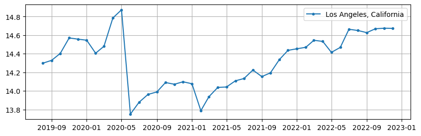
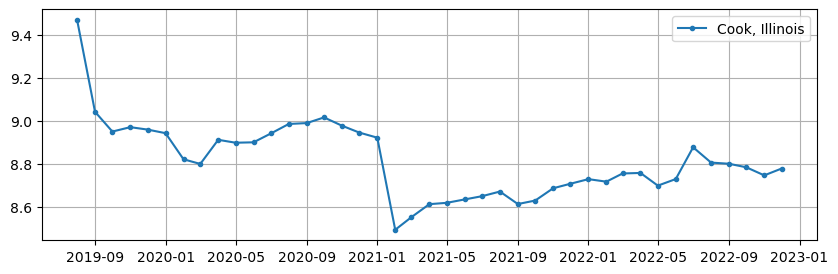
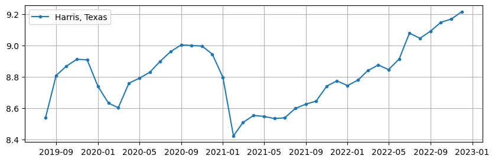
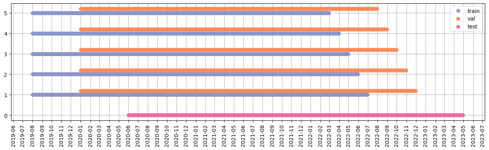
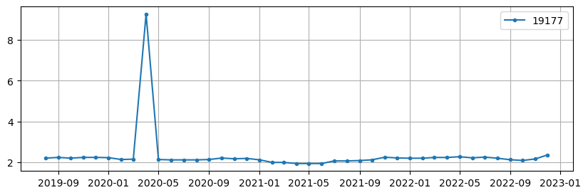
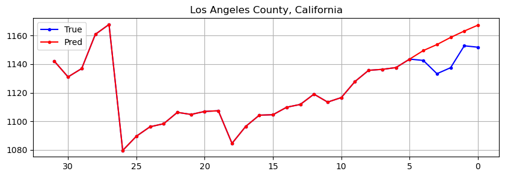
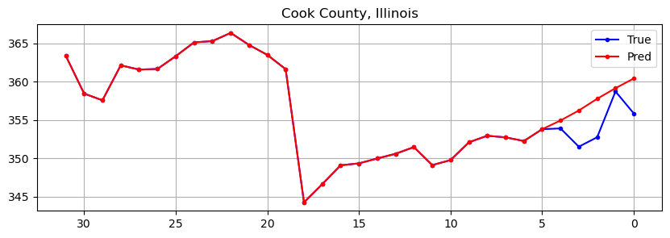
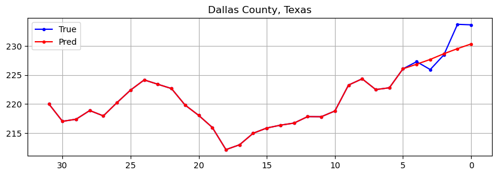
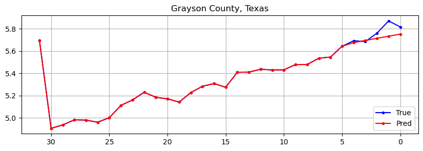
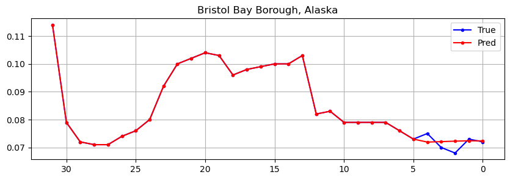

# GoDaddy - Microbusiness Density Forecasting competition 

* Competition link: [GoDaddy - Microbusiness Density Forecasting](https://www.kaggle.com/competitions/godaddy-microbusiness-density-forecasting/overview) 

* "The goal of this competition is to predict monthly microbusiness density in a given area."

#### Definitions:
* **Microbusiness** definition varies across states and localities. In general it is defined as a business that has fewer than 10 employees.
  <a href='https://www.godaddy.com/ventureforward/microbusiness-datahub/'>GoDaddy</a> is the host of this competition and provided the following description:

  "Microbusinesses are generally defined as businesses with an online presence and ten or fewer employees."

* **Microbusiness density** (MB density) in a county is defined as number of microbusinesses divided by the number of adults.

  (Information about population size is taken from <a href='https://data.census.gov/'>USA census data </a>for the year in question.)

## Map:
* There are 3135 counties for which we need to predict future MB density. This is how MB density looks for the December 2022:

<!--  -->
<!--  -->

We can see that most of the counties have MB density in range 0-10, some in 10-20, and only few have larger MB density. 

## Changes over time
We are provided data for 3 years and 5 months - from 2019.8.1. to 2022.12.31. The goal is to predict data for months March, April and May of 2023.

Lets see how microbusiness density changed for some counties over that time:

## Cleaning and splitting the data

* Good train test splits are very important for problems like this. I used 5 folds split, predicting 5 months into the future. Hypotheses were generally rejected if they did not improve the score of all the folds.

Data had to be investigated and cleaned from strange irregularities, like sudden spikes, and drops. For example:

* We can notice a sudden drop at the date 2021.1.1 in previous images. Such occurrence is not a mistake and is a change in MB density calculation methodology. So for the final model that needed to be taken into consideration.

* Another found problem was with sudden spikes and similar sudden changes. Those were detected using a variant of a lowpass filter and then manually checked and "flattened".

## Feature engineering

* Features that improved the score were the statistical data about changes of MB density over time, such as mean values of previous 12 months, and maximum changes of MB density in previous periods, for example.

* Various outside data sources were tested to be added as new features, but only information about counties geographical position ended up in a final model.

* It was chosen to make predictions on total amount of microbusinesses instead of it's density, in order to remove potential sudden changes as population data updates.

## Model chosen

* Models from XGBoost, LightGBM and Neural network model written in Pytorch were considered and tested. 
* Custom small NN model was chosen. It consists of 94,554 parameters from Linear layers. Number of layers and parameters was chosen to avoid overfitting and to get a robust model. 

## Predictions / True values

* Generally, predictions were very dependent on the last values and had a tendency to show raise of MB density.
* On validation data, this is how predictions look(for the total amount of businesses in thousands):

